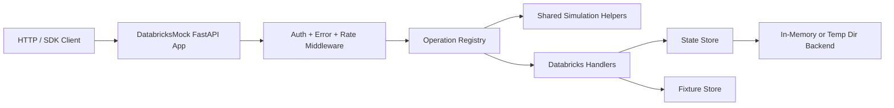

# Semblance Databricks Package Plan

## 1. Purpose

Build a new package named `semblance-databricks` that simulates the Databricks REST API for local development and testing. The package should provide deterministic, reproducible, and fast responses for common Databricks workflows without requiring a live workspace.

The package is an unofficial compatibility layer. It is not affiliated with or endorsed by Databricks and should make this explicit in docs and error text where relevant.

## 2. Goals and Non-Goals

### Goals

- Provide local HTTP endpoints for Databricks API v2.1 style workflows.
- Support SDK and raw HTTP clients with identical behavior.
- Offer deterministic fixture-driven data with repeatable ordering, ids, and pagination.
- Provide controlled authentication and clear error/ratelimit simulation.
- Include a compatibility manifest per endpoint with support levels and last validation date.
- Include a CLI and Python API to run as ASGI app or helper in tests.

### Quality objectives

- deterministic by default at seed level
- fast startup and steady-state response (single-process test-friendly)
- safe default behavior for unknown/invalid inputs
- behavior stable across Python 3.10-3.12

### Non-Goals

- Full Databricks compute replication.
- Running real jobs or executing user code.
- Production-grade security or auth token introspection.
- Infinite API breadth in v1 release.

## 3. Package and Repo Layout

Add a sibling package under the repo root:

```text
packages/
  semblance-databricks/
    pyproject.toml
    README.md
    CHANGELOG.md
    src/
      semblance_databricks/
        __init__.py
        app.py
        cli.py
        config.py
        auth.py
        errors.py
        ids.py
        registry.py
        state.py
        compatibility.py
        models/
        services/
          workspace/
          clusters/
          jobs/
          dbsql/
          secrets/
          users/
        fixtures/
          loaders.py
          defaults/
            minimal.json
        templates/
          examples/
        py.typed
    tests/
      unit/
      contract/
      compatibility/
      fixtures/

```

Add package entry points at repository root for running this package independently and in combination with core `semblance` tooling.


## 4. Public API Proposal

Proposed minimal API:

```python
from semblance_databricks import DatabricksMock, DatabricksMockConfig

mock = DatabricksMock(
    DatabricksMockConfig(
        seed=123,
        auth="optional",
        stateful=True,
        base_domain="https://api.cloud.databricks.com",
    )
)

mock.load_fixture("tests/fixtures/sample_workspace.json")
app = mock.as_fastapi()
```

CLI:

```bash
semblance-databricks serve --fixture fixtures/sample_workspace.json --port 8080
semblance-databricks validate fixtures/sample_workspace.json
semblance-databricks fixture init --output sample_workspace.json
semblance-databricks operations
```

Recommended runtime defaults:

- deterministic seed: `SEMBLANCE_DATABRICKS_SEED`
- default auth mode: `optional`
- default port: `8080`
- base path: `/api/2.1` for cluster/jobs/spaces-style endpoints
- operation mode: permissive by default, strict in CI with `--strict`

## 5. Compatibility Model

Each endpoint must be tracked in `compatibility.yaml` with:

- method and path template
- support level: `exact`, `representative`, `stub`, `unsupported`
- query/body fields supported
- response shape and key status codes covered
- error variants supported
- request/response examples
- fixture schema version
- last doc verification date
- supportNotes and known-limits
- test tags: `unit`, `contract`, `compat`

Unknown endpoints return API-accurate `404` unless flagged as known-unimplemented (where an explicit `501` can be used in strict mode).

Compatibility manifest shape (suggested):

```yaml
packageVersion: "0.1.0"
documentedAt: "2026-08-18"
source: "Databricks API v2.1"
operations:
  - operationId: ListClusters
    method: GET
    path: /api/2.1/clusters/list
    supportLevel: exact
    supports:
      - order
      - limit
      - next_page_token
    strictChecks:
      unknownQueryKeys: reject
      pageToken: signed
    statusCoverage:
      200:
        fixtureRefs:
          - tests/contract/test_clusters.py::test_list_clusters
      400: true
      403: true
      404: false
    lastValidated: "2026-08-18"
    notes: "Supports canonical list + pagination; cursor tokens are opaque and stable"
```

Manifest should be shipped in package root as
`/api/compatibility/semblance-databricks.json` and optionally exposed at
`/.well-known/semblance-databricks-compat.json` for runtime discoverability.

## 6. Focused API Surface by Phase

### Phase A: Workspace & Identity foundation

- Workspace info endpoints (`/api/2.1/workspace/get-status`, etc.)
- users/me and personal token introspection patterns
- clusters: list and get cluster
- jobs: list and get job
- minimal `/api/2.1/jobs/runs/get` and run lookup semantics
- pagination for list endpoints

Concrete phase A endpoint set:

- `GET /api/2.1/clusters/list`
- `GET /api/2.1/clusters/get`
- `GET /api/2.1/jobs/list`
- `GET /api/2.1/jobs/get`
- `GET /api/2.1/jobs/runs/get`
- `GET /api/2.1/workspace/get-status`
- `GET /api/2.1/permissions/cluster/get`

Minimum required request/response fields:

- clusters: `cluster_id`, `cluster_name`, `spark_version`, `node_type_id`, `state`
- jobs: `job_id`, `settings`, `created_time`, `creator_user_name`
- runs: `run_id`, `run_name`, `life_cycle_state`, `state`, `result_state`

### Phase B: Object, SQL, and jobs write operations

- Create/update/get/delete jobs
- Create cluster (stateful), restart/terminate/delete semantics
- Runs: submit run, cancel run, get run status
- SQL warehouses: list/get/create/delete
- Secrets scope/list/set/get semantics using declarative secret values

Concrete phase B endpoints (initial support):

- `POST /api/2.1/clusters/create`
- `POST /api/2.1/clusters/edit`
- `POST /api/2.1/clusters/delete`
- `POST /api/2.1/clusters/restart`
- `POST /api/2.1/clusters/permanent-delete` (optional alias if exposed by fixtures)
- `POST /api/2.1/jobs/create`
- `POST /api/2.1/jobs/reset`
- `POST /api/2.1/jobs/delete`
- `POST /api/2.1/jobs/runs/submit`
- `POST /api/2.1/jobs/runs/cancel`
- `POST /api/2.1/warehouses`
- `PATCH /api/2.1/warehouses`
- `DELETE /api/2.1/warehouses/{warehouse_id}`
- `POST /api/2.1/secrets/put`
- `GET /api/2.1/secrets/list`

#### Cluster startup model

The cluster startup surface in phase B must expose deterministic lifecycle transitions:

- `PENDING` -> `RUNNING`
- `PENDING` -> `ERROR`
- `TERMINATING` -> `TERMINATED`
- `RUNNING` -> `TERMINATING`
- `RESTARTING` -> `RUNNING`

When cluster startup is triggered by `/api/2.1/clusters/create` or `/api/2.1/clusters/restart`, the server should:

- set state to `PENDING` at request accept time
- advance to `RUNNING` on the next lifecycle tick
- expose intermediate state via `clusters/get`
- optionally emit a transition event via `clusters/events` when event endpoints are enabled

Deterministic startup behavior should support these controls per cluster:

- `startupDelayTicks`: integer number of virtual clock ticks before entering `RUNNING`
- `startupFailureMode`: `always_fail | never_fail | random_with_seed`
- `startupFailureAfterTicks`: optional tick at which failure switches to `ERROR`

Example response shape for `clusters/get` during startup:

```json
{
  "cluster_id": "0123-abc",
  "cluster_name": "acme-ingest",
  "spark_version": "13.3.x-scala2.12",
  "node_type_id": "i3.xlarge",
  "state": "PENDING",
  "state_message": "Starting 1/3 nodes"
}
```

When startup fails, `clusters/get` should show:

- `state`: `ERROR`
- `state_message`: stable, fixture-driven reason
- a deterministic error reason for compatibility tests

### Phase C: Compute and artifact simulation

- Libraries install/remove for cluster attachments
- Job task-level outputs and run logs endpoints
- Cluster event log snippets and run timeline
- Lightweight file operation stubs for DBFS-like endpoints in a minimal scope

Concrete phase C endpoints:

- `POST /api/2.1/libraries/install`
- `POST /api/2.1/libraries/uninstall`
- `GET /api/2.1/jobs/runs/get-output`
- `GET /api/2.1/jobs/runs/get-response`
- `GET /api/2.1/clusters/events`
- `GET /api/2.1/dbfs/list`
- `GET /api/2.1/dbfs/read`
- `GET /api/2.1/dbfs/add-block`

### Phase D: Advanced and high-value admin APIs

- Permissions and role-like stubs
- SQL query execution simulation with result chunking
- Audit/event listing with deterministic order and filtering

Concrete phase D endpoints:

- `GET /api/2.1/permissions/cluster/get`
- `PATCH /api/2.1/permissions/cluster/put`
- `POST /api/2.1/sql/statements`
- `GET /api/2.1/sql/statements/{statement_id}`
- `GET /api/2.1/workspace-events/list`
- `GET /api/2.1/audit-logs`

### Deferred to later releases

- Full Unity Catalog implementation
- Advanced SQL warehouse tuning and cluster scaling internals
- ML/Model Serving full surface
- Delta Live Tables deep parity

## 7. Endpoint Semantics

### Authentication modes

- disabled: skip auth checks
- optional (default): accept any non-empty bearer token
- strict: require configured tokens and optional workspace/audience scoping

### Identity model

- Include stable `userId`, `userName`, `workspaceId`, `accountId`, and token subject mappings from config.
- Support optional workspace-id routing via host or explicit path/header where relevant.

### IDs, tokens, and versions

- Deterministic resource IDs from seed + canonical context.
- API version in routing should be normalized per endpoint family.
- Request IDs should be generated and returned for traceability.

Default headers:

- `x-databricks-request-id`
- `x-databricks-organization-id`
- `date` in RFC 1123 format
- `cache-control: no-store`

### Pagination

- Cursor tokens are opaque and signed/tamper-detectable.
- Deterministic ordering with explicit `order`/`sort` behavior when implemented.
- Invalid tokens return documented-style errors, not empty resets.

Cursor model:

- token format: `<resource>:<rev>:<index>:<hmac>`
- revision increments on mutation to invalidate stale pages when strict mode is enabled
- support `page_token` and `next_page_token` aliases where APIs differ

### Cluster startup lifecycle (Databricks-style)

Define startup lifecycle in `FoundryMockState`-like simulator state:

- request creates cluster with initial `PENDING` state and optional `created_time`
- lifecycle update function advances state per configured tick budget
- lifecycle is repeatable under `behavior.clock=virtual`
- `clusters/get` reflects current state, `clusters/events` can expose startup timeline

Recommended lifecycle transitions and expected statuses:

- initial create -> `PENDING`
- success path -> `RUNNING`
- restart path -> `RESTARTING` then `PENDING` then `RUNNING`
- stop path -> `TERMINATING` then `TERMINATED`
- failure path -> `ERROR`

When `behavior.fail_stage` is `before_write`, cluster writes should fail with a deterministic error before state mutation.

### Errors and simulation controls

- Centralized error mapper covering:
  - permission denied
  - not found
  - bad request
  - too many requests
  - conflict
  - internal failure
- Per-operation failure injection settings:
  - fixed error mode
  - random error rate
  - latency simulation
  - max in-flight operations

Simulation controls should include:

- `behavior.clock`: `real` or `virtual`
- `behavior.clock_start_unix_ms`
- `behavior.error_rate`
- `behavior.latency_ms` with jitter
- `behavior.fail_stage` with values `before_validate`, `before_write`, `after_write`

## 8. Fixture Design

Fixture format should support JSON or YAML:

- workspace object state
- identity map and allowed principals
- clusters, jobs, runs, warehouses, secrets, files metadata
- custom behavior hooks for operations that need dynamic result shaping

Validation at load time:

- unique IDs per resource type
- valid references between resources
- schema validation and unknown-field checks in strict mode
- deterministic defaults from seeded generators

Fixture precedence: explicit fixture data must override generated data by default.

Minimum fixture envelope:

```json
{
  "schemaVersion": 1,
  "fixturesVersion": "2026-08-18",
  "workspace": { "workspaceId": "1234567890", "name": "local" },
  "clusters": [],
  "jobs": [],
  "runs": [],
  "warehouses": [],
  "secrets": []
}
```

Validation rules:

- fail on duplicate IDs
- fail on dangling references
- fail on unknown enum values
- strict-mode unknown fields rejected
- allow partial load in non-strict mode with warnings

## 9. Internal Architecture



Core abstractions:

- `DatabricksOperation` with metadata and handler
- `DatabricksMockState` for clusters/jobs/warehouses/runs/users
- `OperationResult` and `ErrorResponse` model families
- `FixtureLoader`, `FixtureMergePolicy`
- `DatabricksError` and mapper matrix
- storage backend abstraction (`InMemory`, `TempDir`)

## 10. Testing Strategy

### Unit

- fixture validation and merge behavior
- ID determinism and token encoding/decoding
- state machine correctness for run and cluster transitions
- auth mode transitions
- error mapping and response headers

### Contract

- one canonical test per supported endpoint family
- strict query/field validation tests
- status and payload stability tests
- pagination edge cases: first page, empty page, exhausted page, invalid cursor

Golden matrix requirement:

- one positive + one negative response per endpoint
- include expected status, headers, and headers' request-id

### Client compatibility

- raw `httpx` contract checks
- optional official Databricks Python client compatibility tests if available in CI
- include expected failures for unsupported endpoints so test suites can handle fallbacks

### Quality gates

- Python 3.10-3.12
- lint/type-check/test parity with repo patterns
- no network access during unit/contract tests
- deterministic results regardless of order

CI matrix suggestion:

- `py3.10`, `py3.11`, `py3.12`
- sync tests and async tests separated for visibility
- optional scheduled compatibility job against latest supported official client

## 11. Documentation Deliverables

- quickstart for direct API and SDK clients
- fixture schema reference
- endpoint compatibility matrix with support levels
- authentication and simulation guide
- common recipes: jobs lifecycle, run status polling, warehouse mock, secret management
- explicit limitations and unsupported list
- non-affiliation and data handling notice

## 12. Milestones

### Milestone 0: Bootstrap and minimal contract

- scaffold package and CLI
- wire test configuration + basic app factory
- support workspace/jobs/clusters basic GET/list routes with auth + errors

Exit criterion: SDK-like client can list clusters and jobs from fixture without external dependencies.

### Milestone 1: Stateful workspace core

- add create/update/delete jobs and runs
- add submit/cancel/get runs with deterministic status transitions
- add fixture validation and merge rules

Exit criterion: run lifecycle test can create a run, poll status, then cancel deterministically.

### Milestone 2: SQL + warehouse support

- warehouse CRUD
- SQL statement stubs and result paging semantics
- secrets and permission stubs

Exit criterion: query and warehouse endpoints return schema-consistent, seeded payloads and controlled error cases.

### Milestone 2.5: Interim hardening

- add DBFS and run-output/readiness transitions from phase C
- add virtual clock behavior for run lifecycle determinism
- tighten fixture-schema migration checks

Exit criterion: deterministic async state transitions under virtual clock with repeatable errors.

### Milestone 3: Hardening and release

- compatibility pass against documented sources and support manifest
- security/safety review (especially secret and token behavior)
- docs and changelog cleanup
- `1.0.0` readiness gate

## 13. Execution Roadmap

### Day 1-3

- scaffold package, CLI, config, and app factory
- add compatibility manifest generation and `operations` CLI command
- implement first five endpoints from phase A

### Day 4-7

- implement remaining phase A
- add auth modes and error middleware
- create golden tests for `jobs`, `clusters`, pagination, auth

### Day 8-12

- implement core phase B writes
- add seed-based ID generation and fixture validators
- ship minimal docs and example fixture

### Day 13-21

- finish phase C and optional phase D subset
- add virtual-clock + fault injection
- complete v0.1 review and release criteria

## 14. Release and Support Policy

- Semantic versioning for package only.
- Pin compatible `semblance` ranges and test lower+upper supported bounds.
- Define supported Databricks API docs revision dates in manifest.
- Backward-incompatible fixture format changes require migration docs and minor/major version alignment.

Supported versioning model:

- patch: documentation, bug fixes, simulation tuning
- minor: compatible API additions, new endpoints, stable behavior expansion
- major: response-shape changes, required fixture migration, auth or contract policy shifts

## 15. Risks and Mitigations

- Databricks API drift: pin docs revision and require manifest updates per release.
- Over-simulation complexity: keep behaviors callback-based and thin.
- State explosion in long tests: add configurable limits and cleanup hooks.
- Credential confusion: avoid token replay or storage of sensitive material; scrub logs.
- DBFS simulation can balloon artifact storage: cap file size/count by default and require opt-in for large fixtures.

## 16. Definition of Done (v0.1)
- at least 12 contract tests across core families
- at least 1 negative auth/authorization compatibility test
- at least 1 fixture migration/validation test
- unsupported endpoints explicitly documented and tested as 404/501
- full local smoke run for `workspace/jobs/clusters/runs` through both HTTP and any supported SDK
- independent installable package exists under `packages/semblance-databricks`
- `DatabricksMock(...).as_fastapi()` works with fixture-based startup
- workspace/jobs/clusters/runs core read and write routes implemented
- deterministic pagination and error injection covered by tests
- manifest + readme + quickstart published
- tests pass for Python 3.10/3.11/3.12

## References

- Databricks API documentation homepage
- Databricks REST API v2.1 workspace/cluster/jobs sections
- Databricks token and authentication docs
