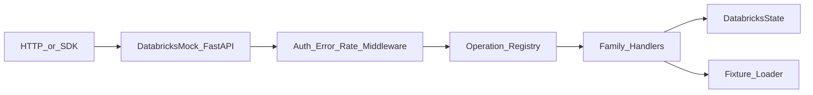

# Semblance Databricks Package Plan

## Status

- **Working name (distribution):** `semblance-databricks`
- **Import package:** `semblance_databricks`
- **Repository:** developed alongside `semblance` under `packages/semblance-databricks/`,
  independently versioned and publishable
- **Status:** implemented as `semblance-databricks` 0.1.0 (Phase 10 A–D). Tag `databricks-v0.1.0` to publish.
- **Roadmap mapping:** [Phase 10](roadmap.md#phase-10--external-api-mock-packages-databricks)
  is phases A–D (workspace compute, jobs, artifacts, permissions, SQL statements).
  Unity Catalog, Model Serving, and DLT are post–Phase 10.
- **Primary objective:** provide a deterministic, local HTTP simulation of selected
  public Databricks workspace REST operations for client development, automated
  tests, demos, and failure-mode testing

`semblance-databricks` is an unofficial compatibility package. It must not claim
affiliation with, endorsement by, or complete behavioral parity with Databricks.
The package should document the Databricks API documentation revision or date
against which each supported operation was implemented.

Public workspace REST operations in this plan are verified against documentation
dated **2026-08-19** unless a newer verification pass is recorded in
`compatibility.yaml`. API families are **not** all `/api/2.1`: Jobs primary paths
are **2.2**; Clusters list/create family is **2.1**; SQL warehouses, DBFS, workspace
secrets, permissions, workspace objects, and SQL statements are **2.0**.

## 1. Problem Statement

Teams integrating with Databricks currently need a live workspace, credentials, and
test data to exercise client code. This makes local development and CI slower,
introduces external state, and makes edge cases such as throttling, failed cluster
starts, paginated job lists, or canceled runs difficult to reproduce.

The package will run a local FastAPI application whose paths, request shapes,
response shapes, status codes, pagination, and state transitions resemble selected
public Databricks workspace REST operations. It will use Semblance for seeded
output, latency/error simulation, and test integration while adding
Databricks-specific behavior in a thin compatibility layer.

`SemblanceAPI` route handlers are ignored by core. Like `FoundryMock`,
`DatabricksMock` is a **custom FastAPI factory** (`as_fastapi()`), not a set of
empty `@api.get` handlers.

## 2. Goals

- Let existing HTTP clients target a local base URL with minimal or no code changes.
- Support both fixture-driven data and allow-listed Python callbacks for SQL/run
  output (never evaluate fixture expressions).
- Preserve process-local state across related calls (cluster lifecycle, job runs).
- Produce deterministic results from a seed so failures are reproducible.
- Model Databricks conventions consistently: bearer authentication, resource IDs,
  `page_token` / `next_page_token`, `{error_code, message}` errors, request IDs.
- Make supported behavior explicit and testable through a compatibility matrix.
- Remain useful as a Python fixture, an ASGI app, and a standalone local server.

## 3. Non-goals

- Reimplementing Spark, Photon, or Databricks compute.
- Running real jobs, notebooks, SQL engines, or user code.
- Perfect parity with undocumented behavior or private/internal APIs.
- Acting as a security emulator or validating real Databricks credentials or OAuth.
- Proxying production traffic or storing production secrets (secret **values** are
  never returned on list/get-key REST; metadata only).
- Unity Catalog, Model Serving, Spark Declarative Pipelines / DLT, or Jobs 2.0 as
  the primary Jobs surface.
- Promoting Databricks- or Foundry-shaped pagination, error envelopes, or auth
  into core Semblance in Phase 10. Copy the `PageTokenCodec` pattern into this
  adapter. Phase 11 may extract a shared primitive later if both adapters stabilize
  the same codec.

## 4. Target Users and Core Scenarios

1. **Client-library tests:** point an HTTP or `databricks-sdk` `WorkspaceClient` at
   the local server and assert request construction and response handling.
2. **Application development:** unblock UI and service work before a workspace is
   ready.
3. **Contract tests:** verify an integration against pinned request/response models
   and known endpoint semantics.
4. **Failure testing:** deterministically simulate authorization failures, missing
   resources, conflicts, throttling, cluster `ERROR`, canceled runs, and latency.
5. **Demo environments:** load a small workspace fixture without a live Databricks
   dependency.

## 5. Package and Repository Layout

Keep the adapter isolated from the core library so Databricks-specific models and
release cadence do not expand `semblance` itself. Shared conventions with
`semblance-foundry`: factory + config object, CLI verbs (`serve`, `validate`,
`fixture init`, `operations`), and a per-operation compatibility manifest.

Phase 10 creates only A–D service trees. Unity Catalog / serving / DLT directories
wait until those milestones.

```text
packages/
  semblance-databricks/
    pyproject.toml
    README.md
    CHANGELOG.md
    LICENSE.md
    src/
      semblance_databricks/
        __init__.py
        app.py                 # DatabricksMock factory and ASGI construction
        cli.py                 # serve, validate, fixture init, operations
        config.py              # typed configuration
        auth.py                # configurable bearer-token simulation
        errors.py              # Databricks error_code/message mapper
        ids.py                 # deterministic IDs and PageTokenCodec
        registry.py            # service/operation registration
        state.py               # process-local DatabricksState
        compatibility.py       # manifest load/publish
        models/
        services/
          clusters/
          jobs/
          workspace/           # get-status, current user
          dbsql/               # warehouses, statements
          secrets/             # workspace secrets 2.0 (not UC secrets)
          dbfs/
          permissions/
        fixtures/
          loaders.py
          defaults/
            acme.yaml
        py.typed
    tests/
      unit/
      contract/
      integration/
      compat/                  # optional @pytest.mark.sdk
```

Logical layers:

| Layer | Modules |
|---|---|
| contracts | `compatibility.py`, `models/`, `registry.py` |
| transport | `app.py`, `auth.py`, `errors.py`, `cli.py` |
| runtime | `state.py`, `ids.py` (`PageTokenCodec`) |
| adapters | `services/*` |
| io | `fixtures/` |

Root `pythonpath`, ruff, and mypy already list `packages/semblance-databricks/src`
([Phase 11](roadmap.md#phase-11--core-infrastructure-for-multi-package-development)).
Phase 10 plugs tests into those paths and extends CI the same way Foundry did
(install `-e packages/semblance-databricks[dev]`, pytest that tree, `-m "not sdk"`).
Do not invent a second CI matrix. Depend on `semblance>=0.7.0,<0.8`. Independent
package version `0.1.0`. Do not tag or publish in the docs-only refinement.

## 6. Public API Proposal

```python
from semblance_databricks import DatabricksMock, DatabricksMockConfig
from semblance_databricks.testing import databricks_test_client

dbx = DatabricksMock(DatabricksMockConfig(seed=42, auth="optional"))
dbx.load_bundled_fixture()  # shipped acme workspace
client = databricks_test_client(dbx)

r = client.get("/api/2.1/clusters/list?page_size=2")
assert r.status_code == 200
```

`load_fixture(path)` loads user YAML/JSON. `as_fastapi()` returns the ASGI app.

CLI (default port **8766** so it does not collide with 8080 or Foundry 8765):

```bash
semblance-databricks fixture init --output databricks.yaml
semblance-databricks validate databricks.yaml
semblance-databricks operations
semblance-databricks serve --fixture databricks.yaml --port 8766
# or: semblance-databricks serve   # bundled acme
```

Local-only environment variables (not Databricks credentials):
`SEMBLANCE_DATABRICKS_HOST`, `SEMBLANCE_DATABRICKS_TOKEN`,
`SEMBLANCE_DATABRICKS_SEED`.

`DatabricksMockContext` should support `with` and pytest fixtures: in-memory
fixture load, per-test state reset, optional shared session state.

## 7. Compatibility Model

Compatibility is per operation in `compatibility.yaml`:

- HTTP method and path template
- API family and version
- support level: `exact`, `representative`, `stub`, or `unsupported`
- request fields and validation covered
- response and error variants covered
- stateful side effects, if any
- upstream documentation URL and last verification date (**2026-08-19** unless
  updated)
- tests that prove the declared level

Unknown paths return Databricks-style **404**. Known-but-unimplemented operations
may return **501** only in `auth=strict`. Optional **representative** aliases for
Jobs **2.1** (`/api/2.1/jobs/...`) may exist for older clients; they are not
`exact` if the pinned SDK uses 2.2.

Emit `/.well-known/semblance-databricks-compat.json`.

## 8. Endpoint Scope (Phase 10 / A–D)

Pinned public workspace REST (docs dated **2026-08-19**). Implementation must copy
method and path from the linked page; if the pinned `databricks-sdk` wire path
differs, record that path as `exact` for the SDK extra and keep the documented
path `exact` or `representative` as proven by HTTP contracts.

### Phase A — Workspace and identity foundation (reads)

| Operation | Method and path | Support | Docs |
|---|---|---|---|
| ListClusters | `GET /api/2.1/clusters/list` | exact | [clusters/list](https://docs.databricks.com/api/workspace/clusters/list) |
| GetCluster | `GET /api/2.1/clusters/get` | exact | [clusters/get](https://docs.databricks.com/api/workspace/clusters/get) |
| ListJobs | `GET /api/2.2/jobs/list` | exact | [jobs/list](https://docs.databricks.com/api/workspace/jobs/list) |
| GetJob | `GET /api/2.2/jobs/get` | exact | [jobs/get](https://docs.databricks.com/api/workspace/jobs/get) |
| GetRun | `GET /api/2.2/jobs/runs/get` | exact | [jobs/getrun](https://docs.databricks.com/api/workspace/jobs/getrun) |
| GetStatus | `GET /api/2.0/workspace/get-status` | exact | [workspace/getstatus](https://docs.databricks.com/api/workspace/workspace/getstatus) |
| CurrentUserMe | `GET /api/2.0/preview/scim/v2/Me` | representative | [current user](https://docs.databricks.com/api/workspace/currentuser/) |

Notes:

- `workspace/get-status` is **object path** status (`path` query), not workspace
  health. Missing path → `RESOURCE_DOES_NOT_EXIST`.
- `CurrentUserMe` is required if the pinned SDK’s `WorkspaceClient` calls it during
  setup; otherwise it may stay representative. Prove localhost SDK in Milestone 0
  or keep SDK tests optional/non-blocking.
- Cluster **lifecycle states** (`PENDING`, `RUNNING`, `RESTARTING`, `TERMINATING`,
  `TERMINATED`, `ERROR`) appear on get/list in A from fixtures; **advancing** those
  states on create/restart is Phase B.
- Minimum fields: clusters `cluster_id`, `cluster_name`, `spark_version`,
  `node_type_id`, `state`; jobs `job_id`, `settings`, `created_time`,
  `creator_user_name`; runs `run_id`, `run_name`, `state.life_cycle_state`,
  `state.result_state`.
- Pagination: `page_token` / `next_page_token` (and documented `page_size` /
  `limit` aliases per operation).

### Phase B — Stateful compute, jobs, warehouses, secrets

| Operation | Method and path | Support | Docs |
|---|---|---|---|
| CreateCluster | `POST /api/2.1/clusters/create` | exact | [clusters/create](https://docs.databricks.com/api/workspace/clusters/create) |
| EditCluster | `POST /api/2.1/clusters/edit` | representative | [clusters/edit](https://docs.databricks.com/api/workspace/clusters/edit) |
| DeleteCluster | `POST /api/2.1/clusters/delete` | exact | [clusters/delete](https://docs.databricks.com/api/workspace/clusters/delete) |
| RestartCluster | `POST /api/2.1/clusters/restart` | exact | [clusters/restart](https://docs.databricks.com/api/workspace/clusters/restart) |
| PermanentDeleteCluster | `POST /api/2.1/clusters/permanent-delete` | stub | [clusters/permanentdelete](https://docs.databricks.com/api/workspace/clusters/permanentdelete) |
| CreateJob | `POST /api/2.2/jobs/create` | exact | [jobs/create](https://docs.databricks.com/api/workspace/jobs/create) |
| ResetJob | `POST /api/2.2/jobs/reset` | representative | [jobs/reset](https://docs.databricks.com/api/workspace/jobs/reset) |
| DeleteJob | `POST /api/2.2/jobs/delete` | exact | [jobs/delete](https://docs.databricks.com/api/workspace/jobs/delete) |
| SubmitRun | `POST /api/2.2/jobs/runs/submit` | exact | [jobs/submit](https://docs.databricks.com/api/workspace/jobs/submit) |
| CancelRun | `POST /api/2.2/jobs/runs/cancel` | exact | [jobs/cancelrun](https://docs.databricks.com/api/workspace/jobs/cancelrun) |
| ListWarehouses | `GET /api/2.0/sql/warehouses` | exact | [warehouses/list](https://docs.databricks.com/api/workspace/warehouses/list) |
| GetWarehouse | `GET /api/2.0/sql/warehouses/{id}` | exact | [warehouses/get](https://docs.databricks.com/api/workspace/warehouses/get) |
| CreateWarehouse | `POST /api/2.0/sql/warehouses` | representative | [warehouses/create](https://docs.databricks.com/api/workspace/warehouses/create) |
| DeleteWarehouse | `DELETE /api/2.0/sql/warehouses/{id}` | representative | [warehouses/delete](https://docs.databricks.com/api/workspace/warehouses/delete) |
| PutSecret | `POST /api/2.0/secrets/put` | representative | [secrets/putsecret](https://docs.databricks.com/api/workspace/secrets/putsecret) |
| ListSecrets | `GET /api/2.0/secrets/list` | exact | [secrets/listsecrets](https://docs.databricks.com/api/workspace/secrets/listsecrets) |
| ListSecretScopes | `GET /api/2.0/secrets/scopes/list` | exact | [secrets/listscopes](https://docs.databricks.com/api/workspace/secrets/listscopes) |

If a linked page on 2026-08-19 still documents Clusters writes as `/api/2.0/...`,
record **that** path as `exact` and treat 2.1 as alias (or the reverse). Do not
invent `/api/2.1` for SQL warehouses or workspace secrets.

**Cluster / run virtual clock:** `behavior.clock` = `real` | `virtual`. Create or
restart sets `PENDING` (or `RESTARTING` then `PENDING`); ticks advance to
`RUNNING` or `ERROR` from fixture `startupDelayTicks` / `startupFailureMode`.
Submit run: `PENDING` → `RUNNING` → `TERMINATED` with `SUCCESS` or `FAILED`.
Cancel: `TERMINATING` then `TERMINATED` / `CANCELED`. Repeatable under virtual
clock; no wall-clock sleeps in tests.

Secret list/get-key returns **metadata only** (keys, timestamps). Never echo
fixture secret values in HTTP bodies.

### Phase C — Artifacts and storage stubs

| Operation | Method and path | Support | Docs |
|---|---|---|---|
| InstallLibraries | `POST /api/2.0/libraries/install` | representative | [libraries/installlibraries](https://docs.databricks.com/api/workspace/libraries/installlibraries) |
| UninstallLibraries | `POST /api/2.0/libraries/uninstall` | representative | [libraries/uninstalllibraries](https://docs.databricks.com/api/workspace/libraries/uninstalllibraries) |
| GetRunOutput | `GET /api/2.2/jobs/runs/get-output` | representative | [jobs/getrunoutput](https://docs.databricks.com/api/workspace/jobs/getrunoutput) |
| ListClusterEvents | `POST /api/2.1/clusters/events` | representative | [clusters/events](https://docs.databricks.com/api/workspace/clusters/events) |
| ListDbfs | `GET /api/2.0/dbfs/list` | representative | [dbfs/list](https://docs.databricks.com/api/workspace/dbfs/list) |
| ReadDbfs | `GET /api/2.0/dbfs/read` | representative | [dbfs/read](https://docs.databricks.com/api/workspace/dbfs/read) |
| AddBlock | `POST /api/2.0/dbfs/add-block` | stub | [dbfs/addblock](https://docs.databricks.com/api/workspace/dbfs/addblock) |

DBFS is in-memory by default with size/count caps. Temp-dir backend is opt-in.
There are **no** public `workspace-events/list` or `audit-logs` REST paths in this
pin; do not implement invented URLs.

### Phase D — Permissions and SQL statements

| Operation | Method and path | Support | Docs |
|---|---|---|---|
| GetPermissions | `GET /api/2.0/permissions/{object_type}/{object_id}` | representative | [permissions](https://docs.databricks.com/api/workspace/permissions/) |
| UpdatePermissions | `PATCH /api/2.0/permissions/{object_type}/{object_id}` | representative | [permissions](https://docs.databricks.com/api/workspace/permissions/) |
| ExecuteStatement | `POST /api/2.0/sql/statements` | representative | [statementexecution/execute](https://docs.databricks.com/api/workspace/statementexecution/execute) |
| GetStatement | `GET /api/2.0/sql/statements/{statement_id}` | representative | [statementexecution/getstatement](https://docs.databricks.com/api/workspace/statementexecution/getstatement) |

SQL results: static fixture chunks or allow-listed Python callbacks; paginated
`next_chunk_internal` / documented chunk tokens as `representative`. No Spark SQL
engine.

Jobs **2.1** (`/api/2.1/jobs/...`): optional `representative` aliases. Jobs **2.0**
is out of Phase 10 except as `unsupported` 404 (or 501 in `strict` if listed).

### Later (not Phase 10)

Unity Catalog (including `GET /api/2.1/unity-catalog/secrets`), Model Serving,
Spark Declarative Pipelines / DLT, account-level APIs, OAuth device flows, and a
Databricks adapter `1.0.0` stability gate.

## 9. Auth, errors, IDs, pagination, headers

**Auth modes:** `disabled` | `optional` (default) | `strict` (token must be in
`DatabricksMockConfig.tokens`). Never echo tokens. Not an OAuth server.

**Errors:** Databricks `{error_code, message}` (and documented extras). Map
missing resource, bad request, permission denied, invalid token, conflict,
throttling, injected 500. Distinct from Foundry envelopes.

**IDs:** deterministic from seed + resource type + identity (cluster/job/run/
warehouse IDs).

**Pagination:** adapter `PageTokenCodec`; tamper or cross-resource reuse → 400
with a documented-style error, not an empty reset.

**Headers:** `x-request-id` or documented `x-databricks-request-id`; optional
`x-databricks-org-id` from config. Do not claim undocumented headers.

**Simulation:** seed, `error_rate`, `latency_ms` / jitter, rate limit, virtual
clock, `fail_stage` (`before_validate` | `before_write` | `after_write`).

## 10. Fixture Design

YAML/JSON version 1, extra fields rejected. Data only — no expressions.

Bundled `acme`: one workspace, ≥1 cluster (enough rows for two list pages),
≥2 jobs, ≥1 run, ≥1 warehouse, one secret scope with metadata-only keys, a small
DBFS path tree, one notebook path for `get-status`.

```yaml
version: 1
workspace:
  workspaceId: "1234567890"
  name: acme
clusters: []
jobs: []
runs: []
warehouses: []
secretScopes: []
dbfs: []
workspaceObjects: []
```

Load-time validation: unique IDs, dangling references, unknown enums. Process-local
state; no restart durability in Phase 10.

## 11. Internal Architecture



Core types: `DatabricksMock`, `DatabricksMockConfig`, `DatabricksState`,
`DatabricksError`, `PageTokenCodec`, per-family routers. Storage: in-memory
default; capped temp-dir opt-in for DBFS only.

## 12. Testing Strategy

- **Unit:** fixtures, IDs/tokens, cluster/run state machine, auth, error mapping.
- **Contract:** golden HTTP per operation family; pagination; invalid cursor;
  unknown 404 vs strict 501.
- **Integration exit:** list clusters across two pages, get cluster, list/get job,
  get run; then create or restart a cluster (or submit/cancel a run) under virtual
  clock; list secret **keys** without values; get-status for a fixture path.
- **SDK extra:** pin one `databricks-sdk` version; `@pytest.mark.sdk` skipped in
  default CI (`-m "not sdk"`). If `WorkspaceClient` cannot target HTTP localhost,
  keep SDK non-blocking (Foundry rule).
- No network in unit/contract tests. Python 3.10–3.12. Plug into existing root
  lint/typecheck/test/security jobs.

## 13. Documentation Deliverables

README (unofficial notice), fixture schema, compatibility matrix, auth/simulation,
limitations, security (no production tokens in fixtures). User guide under docs
when the package exists (Foundry already has `guides/foundry.md`).

## 14. Implementation sequence

No calendar estimates. Finish A with contracts before B writes.

1. Scaffold `packages/semblance-databricks/` (`DatabricksMock` /
   `DatabricksMockConfig`, CLI, tests, unofficial README, `compatibility.yaml`).
2. Fixture v1 + bundled `acme` + auth/errors/page tokens + well-known manifest.
3. Phase A reads with golden tests; SDK localhost spike.
4. Phase B writes + virtual-clock cluster/run machine + warehouses + secrets
   metadata.
5. Phase C libraries/events/DBFS/run output.
6. Phase D permissions + SQL statements.
7. Docs + CI wiring (same pattern as Foundry). Do not tag until a later release
   pass.

### Exit criteria

- **A:** HTTP client lists fixture clusters across two pages, gets one cluster,
  lists/gets a job, gets a run, and resolves one workspace path — locally.
- **B:** create or restart a cluster (or submit then cancel a run) and observe
  deterministic state under virtual clock; warehouse get; secret keys listed
  without values.
- **C:** get-output or cluster events for a fixture run/cluster; DBFS list of a
  stub path.
- **D:** get permissions for a cluster or job object; execute or get a SQL
  statement with fixture/callback chunks.

Phase 10 DoD is **all of A–D**, not Databricks 1.0.

## 15. Versioning and Support Policy

- Version `semblance-databricks` independently (semver). First implementation
  target: `0.1.0`.
- Depend on `semblance>=0.7.0,<0.8`.
- Pin one official `databricks-sdk` version in the `sdk` extra; untested versions
  are not implied compatible.
- Fixture schema versioned separately from the Python package.
- Response shape, default strictness, fixture schema, and lifecycle defaults are
  compatibility-sensitive.

## 16. Risks and Mitigations

| Risk | Mitigation |
|---|---|
| Docs mix 2.0 / 2.1 / 2.2 | Pin date, per-operation path, SDK wire capture in Milestone 0. |
| “Mock Databricks” implies Spark | Endpoint-level claims; no job/SQL execution engine. |
| SDK requires HTTPS or `*.cloud.databricks.com` | Prove localhost in Milestone 0; SDK extra optional. |
| Secret fixtures leak | Metadata-only REST; never log tokens; redact error bodies. |
| DBFS memory growth | Caps; temp-dir opt-in. |
| Shared codec temptation | Copy `PageTokenCodec`; extract in Phase 11 only if both adapters match. |
| Trademark confusion | Unofficial/non-affiliation notice; no copied proprietary schemas. |

## 17. Locked Decisions

1. **Consumers:** raw HTTP and `databricks-sdk` `WorkspaceClient` against the same
   ASGI app. HTTP contracts required. One pinned SDK version is optional/non-blocking
   if it cannot target localhost.
2. **Repo:** `packages/semblance-databricks/` in this repository, independently
   versioned, `semblance>=0.7.0,<0.8`.
3. **Factory:** custom FastAPI (`DatabricksMock.as_fastapi()`), not `SemblanceAPI`
   handlers.
4. **Auth default:** `optional`. Also `disabled` and `strict`. Never echo tokens.
5. **Persistence:** process-local. Temp-dir only as capped DBFS opt-in.
6. **Phase 10 exit:** A–D as pinned in §8, not Databricks 1.0.
7. **Pagination/errors:** adapter-owned; do not add Databricks-shaped helpers to
   core in Phase 10.
8. **Unknown vs unimplemented:** 404 vs 501-only-in-`strict`.
9. **Jobs primary version:** 2.2. Jobs 2.1 aliases may be `representative`.
10. **Docs date:** public workspace REST dated 2026-08-19 unless
    `compatibility.yaml` records a newer pass.
11. **CLI port:** default 8766.
12. **No invented admin APIs:** no fake audit-log or workspace-events REST.

## 18. Definition of Done for Phase 10

Complete when:

- the package installs independently and exposes `DatabricksMock`,
  `DatabricksMockConfig`, `as_fastapi()`, `load_bundled_fixture()`
- HTTP client (and SDK if CI-feasible) passes the A–D exit criteria in §14
- bundled fixture meets §10
- cluster/run virtual-clock transitions have deterministic tests
- missing resources, invalid requests, invalid tokens, denied access, throttling,
  and injected failure each have tests
- state resets without process restart
- compatibility matrix links every implemented operation to tests and the public
  docs used
- README, limitations, security guidance, and non-affiliation notice are complete
- root lint, typecheck, tests, and security jobs include this package for Python
  3.10–3.12

Adapter `1.0.0` is not part of this DoD.

## References

- [Roadmap Phase 10](roadmap.md#phase-10--external-api-mock-packages-databricks)
- [Databricks workspace REST](https://docs.databricks.com/api/workspace/)
- [List clusters](https://docs.databricks.com/api/workspace/clusters/list)
- [List jobs](https://docs.databricks.com/api/workspace/jobs/list)
- [Get a single job run](https://docs.databricks.com/api/workspace/jobs/getrun)
- [Create a job](https://docs.databricks.com/api/workspace/jobs/create)
- [Cancel a run](https://docs.databricks.com/api/workspace/jobs/cancelrun)
- [List secret keys](https://docs.databricks.com/api/workspace/secrets/listsecrets)
- [SQL warehouses](https://docs.databricks.com/api/workspace/warehouses/)
- [Databricks SDK for Python](https://docs.databricks.com/aws/en/dev-tools/sdk-python)
