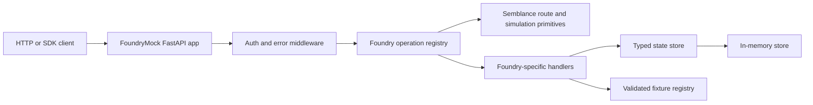

# Semblance Foundry Package Plan

## Status

- **Working name (distribution):** `semblance-foundry`
- **Import package:** `semblance_foundry`
- **Repository:** developed alongside `semblance` under `packages/semblance-foundry/`,
  independently versioned and publishable
- **Status:** milestones 0–1 implemented (ontology-read MVP). Milestones 2–5 are post–Phase 9.
- **Roadmap mapping:** [Phase 9](roadmap.md#phase-9--external-api-mock-packages-foundry)
  is milestones 0–1 (ontology-read MVP). Milestones 2–5 are post–Phase 9.
- **Primary objective:** provide a deterministic, local HTTP simulation of the
  public Palantir Foundry REST API for client development, automated tests, demos,
  and failure-mode testing

`semblance-foundry` is an unofficial compatibility package. It must not claim
affiliation with, endorsement by, or complete behavioral parity with Palantir.
The package should document the Foundry API documentation revision or date against
which each supported operation was implemented.

Public API v2 operations in this plan are verified against documentation dated
**2026-08-18** unless a newer verification pass is recorded in `compatibility.yaml`.

## 1. Problem Statement

Teams integrating with Foundry currently need a live enrollment, credentials, and
test data to exercise client code. This makes local development and CI slower,
introduces external state, and makes edge cases such as throttling, failed actions,
or paginated responses difficult to reproduce.

The package will run a local FastAPI application whose paths, request shapes,
response shapes, status codes, pagination, and state transitions resemble selected
public Foundry API v2 operations. It will use Semblance for route registration,
schema-driven generation, seeded output, latency/error simulation, and test
integration while adding Foundry-specific behavior in a thin compatibility layer.

## 2. Goals

- Let existing HTTP clients target a local base URL with minimal or no code changes.
- Support both generated sample data and user-supplied fixtures.
- Preserve process-local state across related calls when enabled (fixture graph for
  Phase 9; actions and dataset transactions later).
- Produce deterministic results from a seed so failures are reproducible.
- Model Foundry conventions consistently: bearer authentication, resource
  identifiers (RIDs), API names, page tokens, error envelopes, and request IDs.
- Allow users to enable only the services and resources needed by a test.
- Make supported behavior explicit and testable through a compatibility matrix.
- Remain useful directly as a Python fixture, as an ASGI app, and as a standalone
  local server.

## 3. Non-goals

- Reimplementing Foundry's storage, compute, permissions, or ontology engine.
- Executing real transforms, SQL, models, functions, or arbitrary Foundry logic.
- Perfect parity with undocumented behavior or private/internal APIs.
- Acting as a security emulator or validating real Palantir credentials.
- Proxying production traffic or storing production secrets.
- Covering every public API family in the first release.
- Promoting Foundry-shaped pagination, error envelopes, RIDs, or auth into core
  Semblance unless a second adapter immediately needs the same primitive.

## 4. Target Users and Core Scenarios

1. **Client-library tests:** point an HTTP or Foundry SDK client at the local server
   and assert request construction and response handling.
2. **Application development:** unblock UI and service work before a Foundry
   enrollment or ontology is ready.
3. **Contract tests:** verify an integration against pinned request/response models
   and known endpoint semantics.
4. **Failure testing:** deterministically simulate authorization failures, missing
   resources, conflicts, throttling, service errors, and latency.
5. **Demo environments:** load a small ontology fixture without a live Foundry
   dependency (dataset fixtures come after Phase 9).

## 5. Package and Repository Layout

Keep the adapter isolated from the core library so Foundry-specific models and
release cadence do not expand `semblance` itself. Shared conventions with the
planned Databricks adapter: factory + config object, CLI verbs
(`serve`, `validate`, `fixture init`, `operations`), and a per-operation
compatibility manifest.

Phase 9 creates only the ontology service tree. `datasets/`, `orchestration/`,
and `streams/` directories wait until those milestones.

```text
packages/
  semblance-foundry/
    pyproject.toml
    README.md
    CHANGELOG.md
    src/
      semblance_foundry/
        __init__.py
        app.py                 # FoundryMock factory and ASGI construction
        cli.py                 # serve, validate, fixture init, operations
        config.py              # typed configuration
        auth.py                # configurable bearer-token simulation
        errors.py              # Foundry-style error responses
        ids.py                 # deterministic RIDs and PageTokenCodec
        registry.py            # service/operation registration
        state.py               # process-local FoundryState
        compatibility.py       # manifest load/publish
        models/                # shared and service-specific Pydantic models
        services/
          ontologies/          # Phase 9 read operations
        fixtures/              # loaders and bundled minimal examples
        py.typed
    tests/
      unit/
      contract/
      integration/
      fixtures/
```

Logical layers map onto those modules; they are not a second directory tree:

| Layer | Modules |
|---|---|
| contracts | `compatibility.py`, `models/`, `registry.py` |
| transport | `app.py`, `auth.py`, `errors.py`, `cli.py` |
| runtime | `state.py`, `ids.py` (`PageTokenCodec`) |
| adapters | `services/ontologies/` |
| io | `fixtures/` |

Workspace `pythonpath`, ruff, and mypy entries for `packages/semblance-foundry/src`
are Phase 11 work (already started at the repo root). Phase 9 plugs tests into
those paths rather than owning the monorepo CI matrix. The adapter depends on
`semblance` through a normal version constraint; a development extra may reference
the repository checkout.

## 6. Public API Proposal

The smallest useful API is a factory plus a configuration object:

```python
from semblance_foundry import FoundryMock, FoundryMockConfig

foundry = FoundryMock(
    FoundryMockConfig(
        seed=42,
        auth="optional",
        stateful=True,
    )
)

foundry.load_fixture("tests/fixtures/acme.yaml")
app = foundry.as_fastapi()
```

Testing should not require a listening socket:

```python
def test_lists_employees(foundry_client, foundry_mock):
    foundry_mock.ontologies.add_objects(
        ontology="acme",
        object_type="Employee",
        objects=[{"employeeId": "1", "name": "Ada"}],
    )

    page = foundry_client.ontologies.OntologyObject.list(
        ontology="acme",
        object_type="Employee",
    )
    assert page.data[0]["name"] == "Ada"
```

Proposed command-line interface:

```bash
semblance-foundry serve --fixture foundry.yaml --port 8765
semblance-foundry validate foundry.yaml
semblance-foundry fixture init --output foundry.yaml
semblance-foundry operations
```

Environment variables should mirror the concepts a client already uses while
remaining clearly local, for example `SEMBLANCE_FOUNDRY_HOST` and
`SEMBLANCE_FOUNDRY_TOKEN`.

Proposed programmatic helpers:

```python
from httpx import AsyncClient
from semblance_foundry.testing import FoundryMockContext

async def test_search(foundry_client: AsyncClient):
    async with FoundryMockContext(seed=7, fixture="fixtures/acme.yaml") as server:
        async with AsyncClient(base_url=server.base_url, timeout=30) as client:
            response = await client.get("/api/v2/ontologies/acme/objects/Employee")
            assert response.status_code == 200
```

`FoundryMockContext` should support both `with` and `pytest` fixtures:

- one-shot in-memory fixture loading
- per-test automatic state reset
- optional shared state across a test session

## 7. Compatibility Model

Compatibility is defined per operation, not for the platform as a whole. Each
operation in `compatibility.yaml` should record:

- HTTP method and path template
- API family and version
- support level: `exact`, `representative`, `stub`, or `unsupported`
- request fields and validation constraints covered
- response and error variants covered
- stateful side effects, if any
- upstream documentation URL and last verification date
- tests that prove the declared level

Release notes must call out compatibility changes. Unknown endpoints return a
normal `404`. Known but deliberately unimplemented operations may return a
recognizable `501` response **only in `strict` mode**.

Suggested `compatibility.yaml` schema:

```yaml
packageVersion: "0.1.0"
documentedAt: "2026-08-18"
source: "https://www.palantir.com/docs/foundry/api/v2"
operations:
  - operationId: ListObjectTypes
    method: GET
    path: /api/v2/ontologies/{ontology}/objectTypes
    supportLevel: exact
    supports:
      - pageSize
      - pageToken
    limits:
      maxPageSize: 1000
    tests:
      - tests/contract/test_ontology_types.py::test_list_types
```

The manifest is emitted as `/.well-known/foundry-mock-compatibility.json` and
included in packaging output so users can diff local behavior against a pinned
compatibility set.

## 8. Endpoint Scope

### Phase A: Ontology read operations (Phase 9 / MVP)

Pinned public API v2 list (docs dated 2026-08-18). Search is `representative`,
not `exact`. Query execute stays in the MVP.

| Operation | Method and path | Support |
|---|---|---|
| List ontologies | `GET /api/v2/ontologies` | exact |
| Get ontology | `GET /api/v2/ontologies/{ontology}` | exact |
| List object types | `GET /api/v2/ontologies/{ontology}/objectTypes` | exact |
| Get object type | `GET /api/v2/ontologies/{ontology}/objectTypes/{objectType}` | exact |
| List objects | `GET /api/v2/ontologies/{ontology}/objects/{objectType}` | exact |
| Get object | `GET /api/v2/ontologies/{ontology}/objects/{objectType}/{primaryKey}` | exact |
| Search objects | `POST /api/v2/ontologies/{ontology}/objects/{objectType}/search` | representative (eq/and filters only) |
| List linked objects | `GET /api/v2/ontologies/{ontology}/objects/{objectType}/{primaryKey}/links/{linkType}` | exact |
| List / get action types | `GET /api/v2/ontologies/{ontology}/actionTypes` and get-by-name | exact (metadata; no apply) |
| List / get query types | `GET /api/v2/ontologies/{ontology}/queryTypes` and get-by-name | exact |
| Execute query | `POST /api/v2/ontologies/{ontology}/queries/{queryApiName}/execute` | representative (static fixture or allow-listed Python callback; never eval fixture expressions) |

Also in Phase 9:

- cursor pagination through `pageSize`, `pageToken`, and `nextPageToken`
- basic property selection and deterministic ordering where documented
- an example ontology with object types, link types, objects, action-type
  metadata, and one query type

Cursor tokens are owned by the adapter (`PageTokenCodec`). Core Semblance stays
offset/limit (`PageParams` / `PaginatedResponse`); do not block MVP on a core
pagination redesign.

### Phase B: Ontology writes and richer queries (post–Phase 9)

- apply an action and apply action batch
- configurable action handlers that may create, update, link, or delete objects
- aggregate objects and object sets
- temporary object sets
- attachment metadata and small in-memory attachment content
- configurable action validation failures and result modes

Action handlers are local test callbacks. They must never execute arbitrary code
from an untrusted fixture file.

### Phase C: Datasets and transactions (post–Phase 9)

- create and get datasets
- branches: create, list, get, and delete
- schemas: get and put
- transactions: create, get, commit, and abort
- files: upload, list, read, and delete where part of the selected public contract
- read table data from fixture-backed rows

Dataset content should use a pluggable storage abstraction. The default backend can
store metadata and small byte payloads in memory; a temporary-directory backend can
cover larger integration tests. Transaction state must enforce a simple lifecycle
(`OPEN -> COMMITTED` or `OPEN -> ABORTED`) and reject invalid transitions.

### Phase D: Orchestration and streams (post–Phase 9)

- schedules: get, run, pause, unpause, and list runs
- builds and jobs with configurable asynchronous state progression
- streaming dataset and stream metadata
- publish and consume JSON or binary records
- reset streams and retrieve end offsets

Async resources should use a deterministic virtual clock or explicit
`advance()` hook by default, avoiding sleep-based tests.

### Deferred

Models, SQL execution, media/time-series streaming, websites, Notepad, Workbench,
LLM proxy APIs, and beta or enrollment-specific APIs remain out of scope until a
concrete user need and contract-test strategy exist.

## 9. Data and Fixture Design

Use YAML or JSON for declarative fixtures, validated into Pydantic models before
the server starts. Phase 9 fixtures describe the ontology graph (types, objects,
links, action/query metadata). Apply-action `behavior` blocks belong to Phase B.

```yaml
version: 1
ontologies:
  - apiName: acme
    objectTypes:
      - apiName: Employee
        primaryKey: employeeId
        objects:
          - employeeId: "1"
            name: Ada Lovelace
      - apiName: Office
        primaryKey: officeId
        objects:
          - officeId: "hq"
            name: Headquarters
    linkTypes:
      - apiName: worksAt
        from: Employee
        to: Office
        objects:
          - from: "1"
            to: "hq"
    actionTypes:
      - apiName: renameEmployee
        parameters:
          - employeeId
          - newName
    queryTypes:
      - apiName: employeesByOffice
        result:
          type: static
          objects:
            - employeeId: "1"
              name: Ada Lovelace
```

Fixture requirements:

- reject duplicate API names and primary keys at load time
- validate links and action/query type references before serving
- generate omitted RIDs deterministically from stable fixture identity
- support composition of multiple fixture files with explicit conflict rules
- support user extensions without allowing silent unknown fields in strict mode
- provide a Python builder API for cases that are awkward or unsafe to express in
  data files
- never evaluate expressions or callbacks from YAML; custom query (and later
  action) behavior is allow-listed Python only

Generated data is useful for volume tests, but explicit fixtures take precedence.
Generation rules should be seeded and attach stable primary keys so pagination and
links remain repeatable.

## 10. Request and Response Semantics

### Authentication and authorization

Three modes:

- `disabled`: ignore authorization for the shortest local setup
- `optional` (default): accept any syntactically valid bearer token and expose
  hooks for per-operation denial
- `strict`: require tokens declared in test configuration with scopes and resource
  grants

This is a behavioral test double, not an OAuth server. Authentication errors must
never echo token contents.

### IDs and headers

- Generate stable Foundry-like RIDs for fixtures that omit them.
- Include a deterministic request identifier header, with an override hook for
  tests.
- Preserve documented content types for JSON and binary endpoints.

### Response shaping and timing

- Content negotiation should support `application/json` and documented binary
  alternatives where applicable.
- Optional minimum-latency jitter per route to emulate transport variance while
  keeping request ordering deterministic.
- If `Prefer: respond-async` (or equivalent client hint) is received, routes can
  return 202 with server-side job metadata when supported by an operation
  (not required for Phase 9 reads).

### Pagination

- Page tokens must be opaque to clients, URL-safe, and checksummed to detect
  tampering (`PageTokenCodec` in the adapter).
- Tokens should encode a resource revision so mutation between pages can trigger a
  configured consistency behavior.
- Invalid, expired, or cross-endpoint tokens should produce a documented-style
  client error rather than silently restarting at page one.

### Errors and simulation

Create a central exception-to-response mapper for validation, authentication,
permission, missing resource, conflict, throttling, and internal failures. Add
global defaults and per-operation overrides for latency, error probability, fixed
errors, and rate limits. Error injection must occur at defined points so tests can
choose whether a failed write happens before or after a state mutation (writes are
post–Phase 9).

## 11. Architecture



**Core vs adapter:** Semblance owns generic HTTP simulation (route registration,
schema-driven generation, seeding, latency/error knobs, test helpers). The adapter
owns Foundry-specific envelopes, RIDs, cursor tokens, and auth. Promote a primitive
to core only if a second consumer (for example `semblance-databricks`) proves the
same generic need, behind a generic API, tested independently.

Key internal abstractions:

- `FoundryOperation`: method, path, request/response types, compatibility metadata,
  and handler
- `FoundryState`: ontologies, objects, and links for Phase 9; datasets,
  transactions, streams, and asynchronous resources later
- `PageTokenCodec`: opaque token creation and validation
- `FoundryError`: typed error code, name, parameters, and HTTP mapping
- `BehaviorRegistry`: allow-listed Python callbacks for query execute (Phase 9)
  and actions (Phase B)
- `StorageBackend`: in-memory for Phase 9; temporary-directory persistence when
  dataset support lands

## 12. Testing Strategy

### Unit tests

- fixture validation and deterministic RID generation
- page-token round trips, tampering, and resource revision checks
- authentication modes and scope decisions
- error serialization and simulation ordering

### Endpoint contract tests

HTTP contract tests are **required** for every supported Phase 9 operation:

- canonical success request and response
- required/optional parameters and unknown-field behavior
- documented pagination behavior where applicable
- common error statuses and response envelope
- JSON field aliases and omission of optional/null fields where required

Maintain sanitized, hand-authored golden fixtures derived from public documentation.
Do not require live Foundry access in the default test suite. No network in unit
or contract tests.

### Client compatibility tests

- Raw `httpx` tests distinguish wire-contract bugs from SDK behavior.
- One pinned `foundry-platform-sdk` version is the compatibility acceptance test.
  Keep it optional/non-blocking if the SDK cannot target localhost in CI.
- A scheduled job may later test the newest compatible SDK until support policy
  is established.

### Fuzz and negative testing

- property-based checks for fixture conflict handling
- random request permutations for unsupported fields and query combinations
- contract drift tests ensuring unsupported required query params produce stable
  errors rather than silently accepted values

### Quality gates

- Python 3.10, 3.11, and 3.12
- Ruff, mypy, pytest, and coverage thresholds consistent with the parent project
- no network access in unit and contract suites
- deterministic test results regardless of test order
- package build plus clean-environment installation smoke test

## 13. Documentation Deliverables

Phase 9 (package README and stubs; no user-facing Foundry guides on the core
docs site until the package exists):

- quick start for direct HTTP clients (and SDK if CI-feasible)
- fixture format reference with a complete example
- operation compatibility matrix
- authentication and failure-simulation guide
- explicit trademark, security, and non-affiliation notice
- a “known unsupported” checklist (apply/applyBatch, datasets, orchestration)

Post–Phase 9:

- recipes for actions, linked-object mutations, transactions, and streams
- migration notes for compatibility changes
- a minimal example app for both `httpx` and the official SDK

## 14. Delivery Milestones

### Milestone 0: Contract and packaging spike (Phase 9)

- scaffold the independent package under `packages/semblance-foundry/`
- confirm whether the official Python SDK can target a local hostname
- implement one vertical slice: list ontologies and object types with auth,
  pagination, and one error
- keep Foundry-specific pagination/auth in the adapter (do not extend core
  unless a generic primitive is proven)
- publish the initial compatibility manifest

**Exit criterion:** an HTTP client lists two fixture-backed object types (and,
if CI-feasible, the pinned SDK does the same) without a live Foundry service.

### Milestone 1: Ontology read MVP (Phase 9)

- implement the pinned Phase A operations
- add fixture loader, deterministic IDs, three auth modes, and core errors
- ship pytest fixtures and standalone CLI (`serve`, `validate`, `fixture init`,
  `operations`)
- document all supported and unsupported operations

**Exit criterion (Phase 9 done):** HTTP client (and SDK if CI-feasible) lists
fixture objects across two pages, gets by primary key, follows one link, and
executes one configured query — all locally.

### Milestone 2: Stateful ontology behavior (post–Phase 9)

- implement actions, batch actions, aggregates, and object sets
- add safe Python behavior hooks and declarative built-in action behaviors
- cover mutation failures and state isolation between tests

**Exit criterion:** an action changes an object and subsequent reads reflect the
change, with deterministic success and failure tests.

### Milestone 3: Dataset workflows (post–Phase 9)

- implement datasets, branches, schemas, transactions, files, and table reads
- add in-memory and temporary-directory storage backends

**Exit criterion:** a client creates a transaction, writes fixture content, commits
it, and reads the resulting dataset state.

### Milestone 4: Orchestration and streaming (post–Phase 9)

- implement selected schedules, builds, jobs, and stream operations
- add virtual-clock state progression and record offsets

**Exit criterion:** tests can drive an asynchronous build lifecycle and a
publish/consume stream cycle without wall-clock waits.

### Milestone 5: Hardening and first stable release (post–Phase 9)

- run compatibility review against the pinned public API documentation revision
- finalize versioning and upstream SDK support policy
- complete security, packaging, performance, and documentation review
- publish `1.0.0` only when support levels and breaking-change policy are reliable

### Phase 9 implementation sequence

Merge of the former sprint backlog and immediate repository work. No calendar
estimates.

1. Scaffold `packages/semblance-foundry/` (`pyproject.toml`, `src/semblance_foundry`,
   `FoundryMock` / `FoundryMockConfig` export, test layout, README / CHANGELOG /
   non-affiliation notice).
2. Define fixture v1 schema, bundled example fixture, and `compatibility.yaml`.
3. Vertical slice: `GET /api/v2/ontologies` and
   `GET /api/v2/ontologies/{ontology}/objectTypes` with auth middleware, request-id,
   deterministic RIDs, and one golden contract test.
4. Remaining Phase A read operations, cursor pagination, search (eq/and), links,
   action/query type metadata, and query execute.
5. CLI (`serve`, `validate`, `fixture init`, `operations`) and MVP docs.

Every milestone finishes with updated compatibility rows. Plug tests into existing
workspace paths from Phase 11; do not invent a second CI matrix in this package.

## 15. Versioning and Support Policy

- Version `semblance-foundry` independently using semantic versioning.
- Pin a compatible range of `semblance` releases and test its lower and upper
  bounds.
- Treat changes to response shape, default strictness, fixture schema, and stateful
  behavior as compatibility-sensitive.
- Version the fixture schema separately from the Python package and provide
  migrations for breaking fixture changes.
- State supported official SDK versions in package metadata or documentation; do
  not imply that untested versions are compatible.

## 16. Risks and Mitigations

| Risk | Mitigation |
|---|---|
| The public API changes frequently | Pin documentation verification dates, automate contract inventory checks where permitted, and publish per-operation support levels. |
| “Mock Foundry” implies unrealistic completeness | Use precise endpoint-level claims and return explicit unsupported-operation errors in `strict` mode. |
| Stateful behavior becomes a second platform implementation | Limit behaviors to observable test contracts and keep compute/query execution callback-based. |
| SDKs enforce HTTPS or hostname assumptions | Prove local endpoint configuration in Milestone 0; keep SDK tests optional/non-blocking if they cannot target localhost. |
| Fixture files become an arbitrary-code vector | Keep declarative fixtures data-only; require allow-listed Python for custom callbacks and never evaluate fixture expressions. |
| Large files or object volumes exhaust memory | Stay in-memory for Phase 9; add a temporary-directory backend and configurable limits before dataset support is declared stable. |
| Trademark or licensing confusion | Use an explicit unofficial/non-affiliation notice and avoid copying generated SDK code or proprietary schemas. |

## 17. Locked Decisions

These were open before Phase 9 refinement. They are now decided:

1. **Consumers:** raw HTTP and `foundry-platform-sdk` against the same ASGI app.
   HTTP contract tests are required for MVP. One pinned SDK version is the
   compatibility acceptance test (optional/non-blocking if the SDK cannot target
   localhost in CI).
2. **Repo:** `packages/semblance-foundry/` in this repository, independently
   versioned, depending on `semblance` via a normal version range.
3. **Auth default:** `optional`. Also document `disabled` and `strict`. Never echo
   tokens. CI examples use `optional` unless a test is specifically covering
   `strict`.
4. **Persistence:** process-local only for MVP. No restart durability before 1.0.
5. **Phase 9 exit:** ontology-read MVP (milestones 0–1), not Foundry 1.0.
6. **Cursor pagination:** implement in the adapter (`PageTokenCodec`). Do not add
   Foundry-shaped helpers to core in Phase 9 unless a second adapter immediately
   needs the same primitive.
7. **Unknown vs unimplemented:** unknown paths → 404; known-but-unimplemented
   operations may return 501 only in `strict` mode.
8. **Phase A operations and docs date:** the pinned table in §8, verified against
   public API v2 documentation dated 2026-08-18.

## 18. Definition of Done for the MVP

The Ontology read MVP (Phase 9) is complete when:

- the package installs independently and exposes typed public APIs
  (`FoundryMock`, `FoundryMockConfig`, `as_fastapi()`)
- a raw HTTP client passes the ontology-read scenarios below; a configured
  official Python SDK client passes the same scenarios when CI-feasible
- fixtures define at least one ontology, two object types, linked objects, one
  action type (metadata only), and one query type
- object listing supports stable cursor pagination and property selection
- HTTP client lists fixture objects across two pages, gets by primary key,
  follows one link, and executes one configured query — all locally
- missing resources, invalid requests, invalid tokens, denied access, throttling,
  and injected server failure each have deterministic tests
- test state is isolated and resettable without restarting the process
- the compatibility matrix links every implemented operation to its tests and the
  public documentation used
- README, fixture reference, limitations, security guidance, and non-affiliation
  notice are complete
- build, lint, type-check, and test jobs pass for all supported Python versions

Foundry `1.0.0` criteria remain under Milestone 5 and are not part of this DoD.

## References

- [Roadmap Phase 9](roadmap.md#phase-9--external-api-mock-packages-foundry)
- [Palantir Foundry API introduction](https://www.palantir.com/docs/foundry/api/general/overview/introduction)
- [Palantir Foundry API v2 reference](https://www.palantir.com/docs/foundry/api/v2)
- [Palantir Foundry API authentication](https://www.palantir.com/docs/foundry/api/v2/general/overview/authentication)
- [List Ontologies](https://www.palantir.com/docs/foundry/api/v2/ontologies-v2-resources/ontologies/list-ontologies)
- [List Object Types](https://www.palantir.com/docs/foundry/api/v2/ontologies-v2-resources/object-types/list-object-types)
- [List Objects](https://www.palantir.com/docs/foundry/api/v2/ontologies-v2-resources/ontology-objects/list-objects)
- [Search Objects](https://www.palantir.com/docs/foundry/api/v2/ontologies-v2-resources/ontology-objects/search-objects)
- [Foundry API limits](https://www.palantir.com/docs/foundry/api/general/overview/limits)
